# Light Field Refocusing with 4-D Sparse FIR Hyperfan Filter
This is a MATLAB implementation of the sparse FIR hyperfan filter for light field refocusing.

- Reference: Sanduni U. Premaratne, Chamira U. S. Edussooriya, Chamith Wijenayake, Len T. Bruton and Panajotis Agathoklis,"A 4-D Sparse FIR Hyperfan Filter for Volumetric Refocusing of Light Fields", pp.1-5, [IEEE DSP 2018](http://dsp2018.org/home.asp) (Accepted)
- License: [BSD 2-Clause](./BSD_2-Clause_Simplified.md)

We kindly request you to cite the above paper in case you refer this work.

## Conventions
The input light field should be in MAT file format (.mat extension). 

Parameters:
-  - Orientation of the fan filter in the 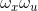 and 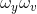 subspaces.
-  - Half fan angle.
- B - Length of the bow-tie shaped passband.
- T - Angular width of the bow-tie shaped passband.

## Results
### Output comparison between sparse and nonsparse FIR Hyperfan filter

Results for both sparse and nonsparse filters of the same parameters, are shown below for selected light fields of [EPFL dataset](https://mmspg.epfl.ch/EPFL-light-field-image-dataset) for visual comparison. As a representative case, following values are chosen for the filter parameters , , *B* and *T*. 

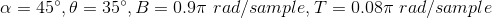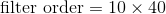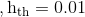

[SSIM](https://en.wikipedia.org/wiki/Structural_similarity) values of the volumetric refocused images obtained using the proposed ***sparse filter***, with respect to those obtained using the nonsparse filter, are given below.

| Light field | Sparse filter | Nonsparse filter | SSIM |
| --- | --- | --- | --- |
| Flowers | 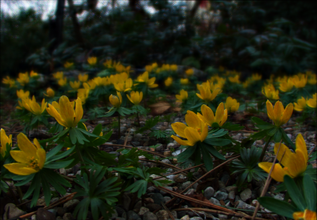 |  | 0.9882 |
| Mirabelle Prune Tree |  | 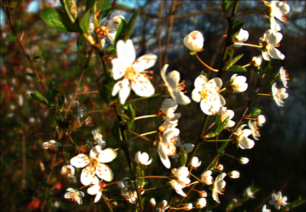 | 0.9714 |
| Sophie & Vincent 1 | 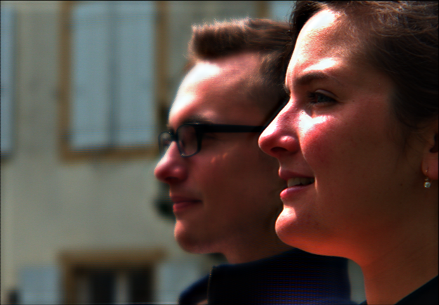 | 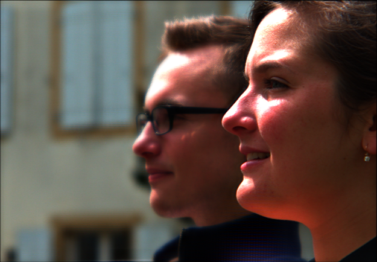 | 0.9897 |
| Swans 1 |  | 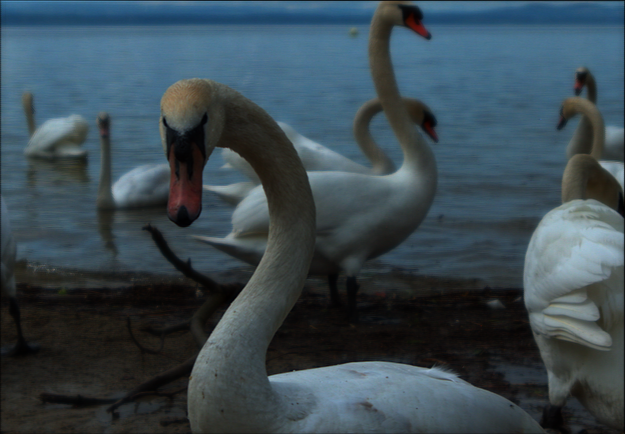 | 0.9916 |

### Output comparison with different 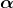 values

Following is a visual comparison of output images obtained using the ***sparse filter*** with different  values, on selected light fields. Here,

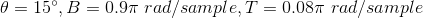

| | =60 | =105 |
| --- | --- | --- |
| Books |  |  |
| Flowers |  | 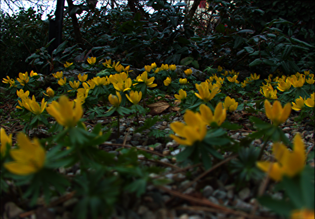 |
| Gravel Garden | 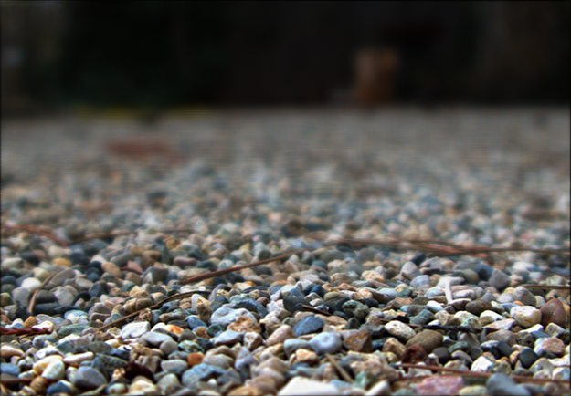 |  |
| Sophie & Vincent 1 | 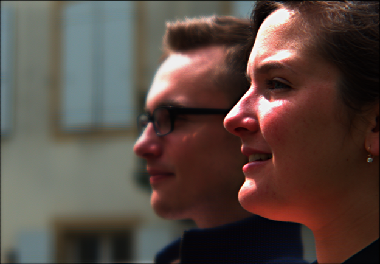 | 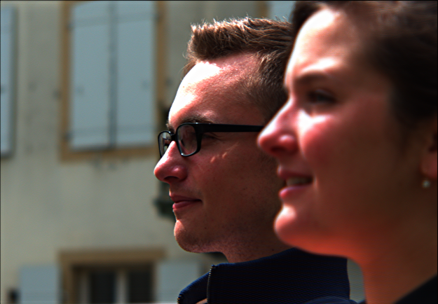 |
| Swans 1 |  | 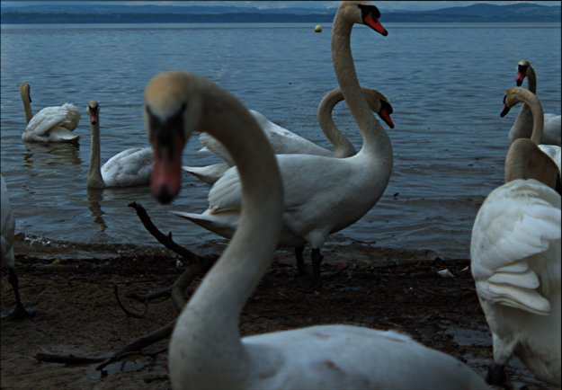 |

### Comparison between sparse and nonsparse FIR Hyperfan filter

Normalized root mean square error (NRMSE) is used to quantify the deviation of the frequency response of the sparse filter compared to the nonsparse filter.

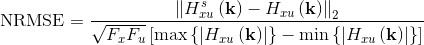                   

where,

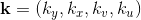

 - Frequency response of the sparse filter

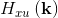 - Frequency response of the nonsparse filter

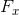 - FFT length for  dimension

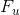 - FFT length for 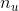 dimension

Furthermore, number of non-zero coefficients of the sparse filter with respect to that of nonsparse filter, can be used as a metric to evaluate the reduction of computational complexity.

##### Varying  and 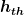

 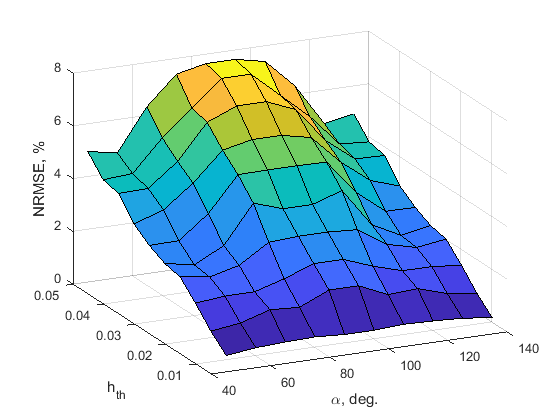  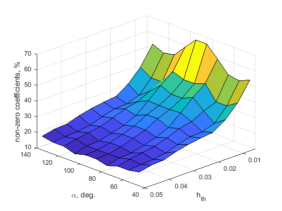 

##### Varying  and 

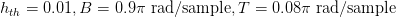

 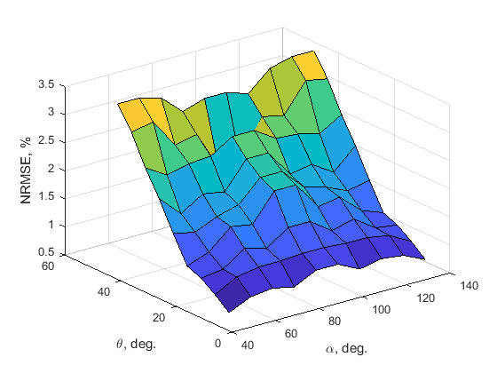  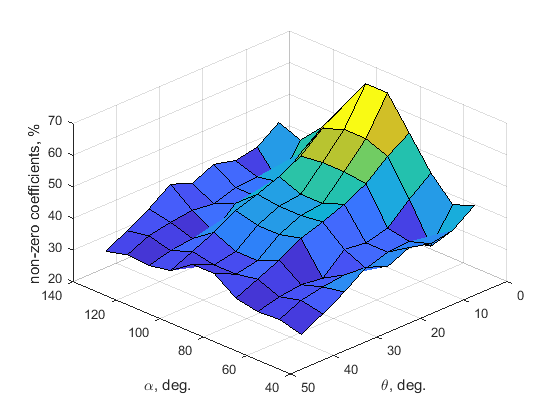
